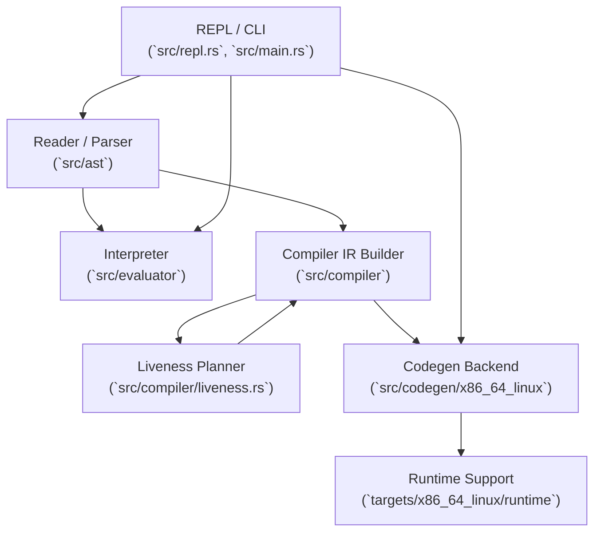

# Slisp

Build: [](https://dl.circleci.com/status-badge/redirect/gh/pirkus/slisp/tree/main)

## Overview

Slisp is a small Lisp implementation written in Rust with both an interactive tree-walking interpreter and a native code compiler. Expressions can be evaluated interactively, JIT-compiled on the fly, or compiled ahead-of-time into standalone ELF executables.

## Getting Started

```bash
cargo build        # Build the project
cargo test         # Run the unit and integration test suite
cargo run          # Start the default interpreter REPL
```

### Command-Line Options

- `slisp` – Launch the interpreter REPL.
- `slisp --compile` – Launch the compiler REPL which JITs expressions to machine code before running them.
- `slisp --compile [--keep-obj] -o <output> <file.slisp>` – Compile a `.slisp`/`.lisp` file that defines `(-main ...)` into a native executable; pass `--keep-obj` to retain the intermediate object file for inspection.
- `slisp --compile --trace-alloc` – Emit allocator telemetry logs in the compiler REPL (build with `--features allocator-telemetry`).
- `slisp --compile --trace-alloc [--keep-obj] -o <output> <file.slisp>` – Compile to an executable that prints allocator telemetry to stdout on exit.

## Supported Functionality

### Interpreter REPL

The interpreter provides a complete Lisp experience with rich error reporting and lexical scoping. Supported features:

- Number, keyword, and string literals (with escapes)
- Arithmetic, comparison, and logical operations
- `if`, `let`, `def`, `defn`, anonymous `fn`, higher-order calls
- `str`, `count`, `get`, `subs`, `hash-map`, `assoc`, `dissoc`, `contains?`
- Vector (`[...]`) and set (`#{...}`) literals plus helpers
- Deterministic rendering for maps/sets and robust runtime errors

### Compiler Modes

Both compiler modes (JIT REPL and AOT executable) support the same surface area as the interpreter:

- Full arithmetic/comparison/logical feature set
- `if`, `let`, `def`, `defn`, lambdas, and closures
- Strings, keywords, vectors, maps, and sets with their helpers
- Keyword literal tagging (`:name`) for map keys and equality
- Automatic heap management via ownership tracking and liveness-based frees
- Linear-stack IR lowered to x86-64 machine code; AOT emits ELF + runtime

## Architecture


## Sample Session

```text
$ cargo run
SLisp Interpreter REPL v0.1.0
slisp> (let [x 5 y 7] (+ x y))
12

$ cargo run -- --compile
SLisp Compiler REPL v0.1.0
slisp-compile> (defn add [a b] (+ a b))
#<function/2>
slisp-compile> (add 3 4)
7
```

To compile a file with a `-main` function into a native executable:

```text
$ cargo run -- --compile --keep-obj -o hello tests/programs/functions/simple_add.slisp
Successfully compiled file 'tests/programs/functions/simple_add.slisp' to 'hello'
```

## Developer Utilities

- `tests/programs/memory/run_allocator_telemetry.sh` – Compiles every memory workload with allocator telemetry enabled, runs each binary under a short timeout, and stores telemetry logs in `target/allocator_runs/logs/`.
- `tests/programs/memory/churn_reuse.slisp`, `tests/programs/memory/mixed_sizes.slisp` – Stress workloads that exercise allocator reuse; inspect the logs produced by the telemetry harness for allocation/free patterns.

## Project Structure

- `src/ast` – S-expression parser
- `src/evaluator` – Tree-walking interpreter
- `src/compiler` – High-level IR generation
- `src/codegen` – x86-64 code generation and ELF output
- `src/repl.rs` – Shared REPL implementation
- `targets/x86_64_linux/runtime/` – Support library linked into compiled executables

## Roadmap

See [PLAN.md](PLAN.md) for detailed progress tracking and upcoming features.
